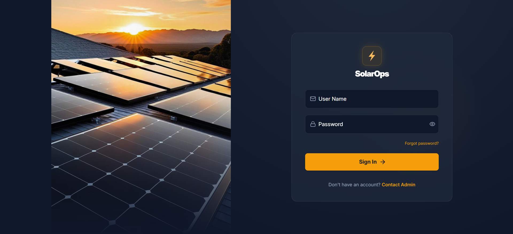

### Solar Ops System

**Role:** Full Stack / Frontend Software Developer </br>
**Stack:** React, Node.js (Express), MySQL/PostgreSQL

# 📌 Project Description

Solar Ops is a full-stack solar plant monitoring and operations platform designed to provide real-time visibility into energy generation, system performance, and operational health.

The system enables operators and engineers to make data-driven decisions through intuitive dashboards, analytics, and alerting mechanisms.

This project focuses on building a scalable, performant, and user-friendly interface for managing solar infrastructure.

# ⚙️ Setup Guide

This guide will help you set up, run, and access the Solar Ops system locally.

---

# 📚 Table of Contents

1. [Requirements](#requirements)
2. [Clone the Repository](#clone)
3. [Install Dependencies](#install-deps)
4. [Environment Setup](#env)
5. [Database Setup](#db)
6. [Start Backend Server](#start-backend-server)  
7. [Start Frontend Server](#start-frontend-server)
8. [Access the Application](#access)
9. [Admin Login (Demo Credentials)](#admin-login) 
10. [Sample Product Images](#images)
11. [Troubleshooting](#troubleshooting)

---

## 1. Requirements <a name="requirements"></a>

- Node.js & npm
- MySQL / PostgreSQL (or your DB)
- Git
---


## 2. Clone the Repository <a name="clone"></a>
```bash
git clone https://github.com/your-username/solar-ops.git
cd solar-ops
```
---

## 3. Install Dependencies <a name="install-deps"></a>
- Backend
```bash
cd backend
npm install
```
- Frontend
```bash
cd frontend
npm install
cd ..
```
---

## 4. Environment Setup <a name="env"></a>
```bash
PORT=5000

DB_HOST=localhost
DB_USER=root
DB_PASSWORD=yourpassword
DB_NAME=solar_ops

JWT_SECRET=your_secret_key
```
---
## 5. Database Setup <a name="db"></a>
---

## 6. Start Backend Server <a name="start-backend-server"></a>
```bash
cd backend
npm start
```
- Server will run on: </br>
👉
[http://localhost:5000](http://localhost:5000)
---
## 7. Start Frontend Server <a name="start-frontend-server"></a>
```bash
cd frontend
npm install
cd ..
```
- App will run on: </br>
👉
[http://localhost:5173](http://localhost:5173)
---

## 8. Access the Application <a name="access"></a>
- Open in browser:
[http://localhost:5173](http://localhost:5173)
---
## 9. Admin Login (Demo Credentials) <a name="admin-login"></a>
- Use below credentials to log into the admin account:
    | Role  | Username |   Password  |
    | ----- | -------- | ----------- |
    | Admin | admin    | admin@12345 |
  
- Admin can create users and manage the ERP system in full rights
- Also you can create new accounts at the login screen
---
## 10. Sample Product Images <a name="images"></a>

---

## 11. Troubleshooting <a name="troubleshooting"></a>
Backend not starting:

- Ensure Node.js is installed
- Run npm install again

Frontend not loading:

- Check for dependency errors
- Delete node_modules and reinstall

Database connection errors:

- Verify DB credentials in .env
- Ensure database service is running

Port conflicts:

- Change backend/frontend ports if already in use
---
